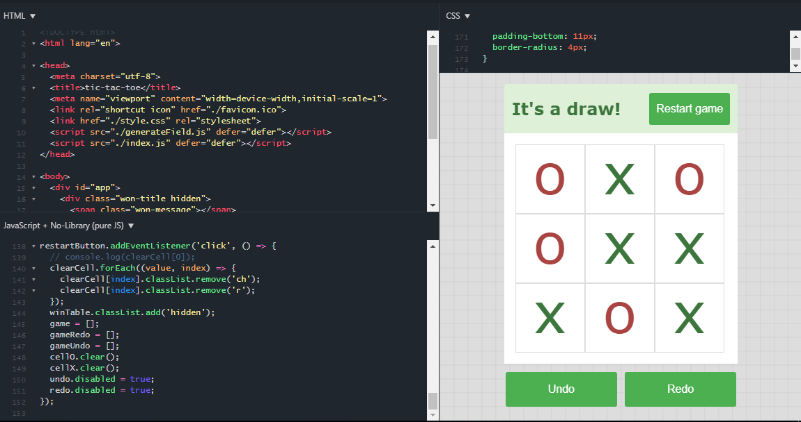

# TicTacToe  • [TryOnFiddle](https://jsfiddle.net/Maximuson/Lp8z1gtf) #

  
 ---

### Написано на чисто JS с готовым шаблоном

 ---

## Возможности ##

>Отмена хода
>>Сделано

>Возврат хода
>>На горизонте

>Перезагрузка игры
>>Сделано

>Прошлое состояние игры после перезагрузки
>>На горизонте

---

> Draw

## Баги и фичи ##

>если зажать  ЛКМ на одной клетке а отпустить в другом месте то елемент появится совсем не там где нужно

