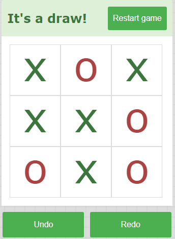
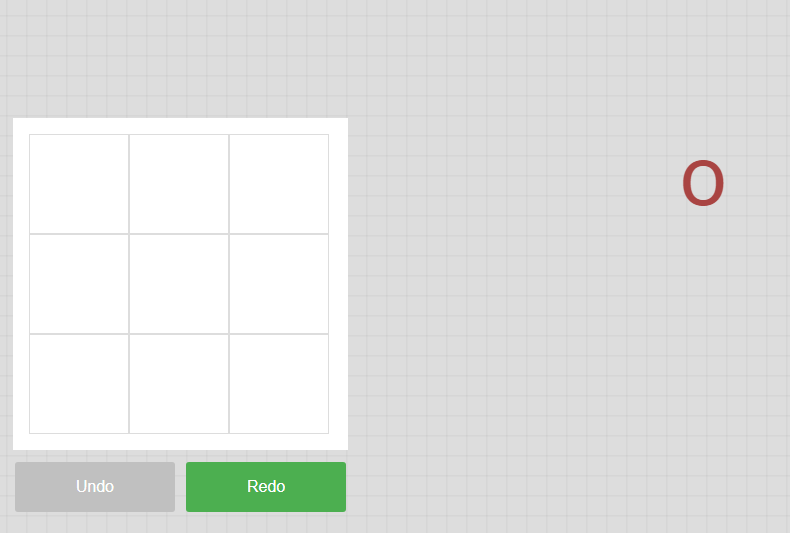

# TicTacToe #

Game

Написано на чисто JS с готовым шаблоном

## Возможности ##

>Отмена хода
>>Сделано

>Возврат хода

>Перезагрузка игры
>>Сделано

>Прошлое состояние игры после перезагрузки

> Draw

## Баги и фичи##

>если зажать  ЛКМ на одной клетке а отпустить в другом месте то елемент появится совсем не там где нужно

